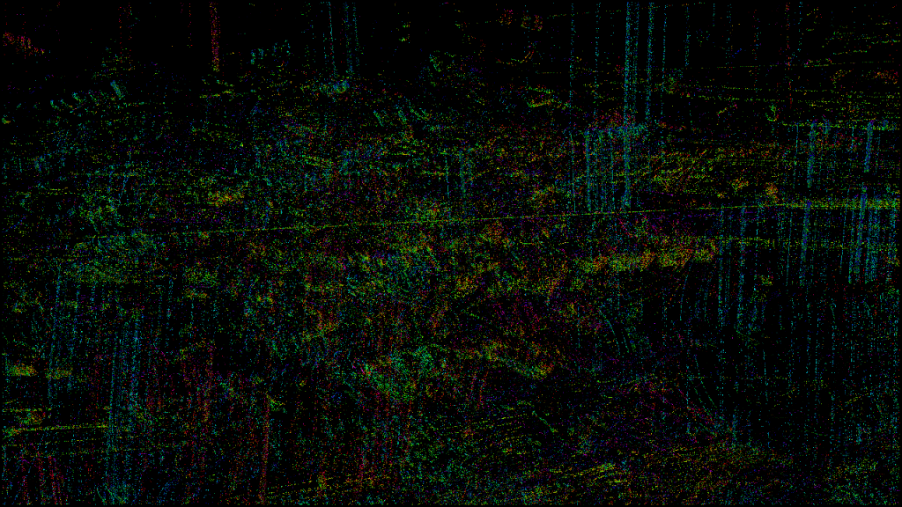
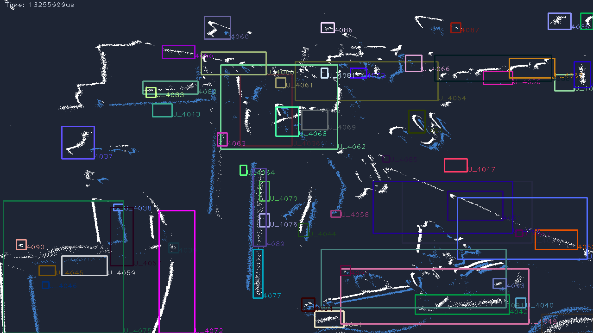
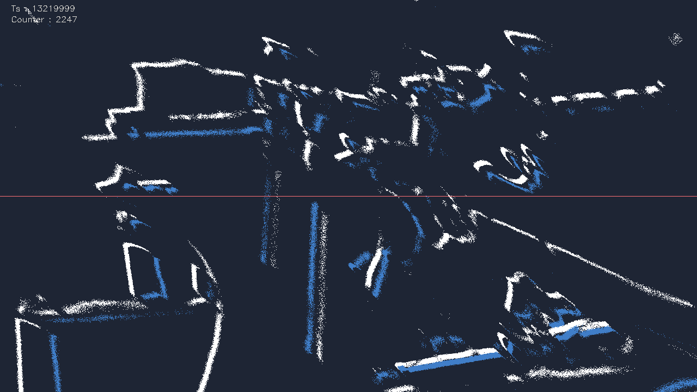

# More model-free pipelines (`evk4_sdk_advanced`)

Beyond sparse [optical flow](optical_flow.md) and [object tracking](tracking.md),
the same harness drives five more Metavision SDK model-free algorithms. They all
share `event_vision_node.hpp` (decode `EventPacket` → `vector<EventCD>` → an SDK
algorithm via `process_events` → publish an image), so the build, real-time
threading, and SDK-lib-path handling are identical — read
[optical_flow.md](optical_flow.md) for those. This page covers only what each
pipeline does and how to run it.

`evk4_sdk_advanced` builds every pipeline together: if you've built it once
([optical_flow.md](optical_flow.md#1-build-the-package)), these are already
built.

## One launch for all of them

**All seven pipelines** (these five plus [optical flow](optical_flow.md) and
[tracking](tracking.md)) share a single parameterized launch — pick the pipeline
with `pipeline:=`:

```bash
ros2 launch evk4_sdk_advanced pipeline.launch.py \
    pipeline:=dense_flow params_file:=$HOME/my_params.yaml
# second terminal:
ros2 run rqt_image_view rqt_image_view /event_camera/dense_flow_image
```

`pipeline` is one of `optical_flow`, `tracking`, `dense_flow`, `spatter`,
`counting`, `frequency`, `led_tracking`; each publishes
`/event_camera/<pipeline>_image`. Common launch args (`camera_name`, `serial`,
`frame_id`, `fps`, `params_file`, `debug_timing`) apply to every pipeline.
Pipeline-specific parameters (below) keep their defaults from the launch;
override them with `ros2 run … --ros-args -p name:=v`.

As always, `params_file:=$HOME/my_params.yaml` feeds your tuned driver setup
(ERC cap, biases, filters) through the driver — that, not the algorithm, is the
main latency/CPU lever on a Pi.

---

## Dense optical flow — `dense_flow`

A full **color flow field** (hue = direction, brightness = speed), vs the sparse
arrows of [optical_flow.md](optical_flow.md). Uses `TripletMatchingFlowAlgorithm`
→ `DenseFlowFrameGeneratorAlgorithm` (dense color map).



*Replay of the test bag: directional color along moving edges. Coverage follows
moving edges — triplet-matching flow is semi-dense, so quiet regions stay dark.*

| Parameter | Default | Description |
|---|---|---|
| `radius` | `3.0` | Spatial match search radius (px) |
| `max_flow` | `1000.0` | Matching ceiling (px/s) |
| `display_max_flow` | `300.0` | Color full-scale speed (px/s) — lower it to brighten slow scenes |

Brightness is each pixel's speed normalized to `display_max_flow`; the default
1000 px/s matching ceiling kept fast motion in range while 300 px/s lights up
ordinary motion. **Validated** on the Pi (2026-06-16, bag replay).

## Particle / spatter tracking — `spatter`

Tracks **many small fast movers at once** (sparks, droplets, particles), each as
a small ID-labeled box over the event image. Uses `SpatterTrackerAlgorithm`.



*Replay of the test bag: each cluster of moving events gets a tracked box and id.*

| Parameter | Default | Description |
|---|---|---|
| `cell_size` | `7` | Tracking cell size (px); smaller = finer particles |

The node keeps the latest box per cluster id and drops ones unseen for 100 ms.
**Validated** on the Pi (2026-06-16, bag replay).

## Object counting — `counting`

Counts objects **crossing a horizontal line** (e.g. parts on a conveyor) and
overlays the running count + timestamp on the event image. Uses
`CountingAlgorithm` + `CountingDrawingHelper`.



*Replay of the test bag: the red line at row 360 with the live `Counter`. On this
busy hand scene the count climbs fast — counting is meant for discrete objects
crossing the line, not a cluttered field.*

| Parameter | Default | Description |
|---|---|---|
| `line_row` | `360` | Image row of the counting line (px from top) |
| `cluster_ths` | `5` | Minimum cluster size to count |

Put the line where objects cross it, and tune the stream (ERC cap, STC) so each
object is one clean cluster. **Validated** on the Pi (2026-06-16, bag replay);
the count is meaningful only for a discrete-object scene.

## Vibration frequency — `frequency`

Estimates the **blink / vibration frequency at each pixel** and renders it as a
JET heat map with a Hz colorbar. For rotating, vibrating, or flickering scenes.
Uses `FrequencyMapAsyncAlgorithm` → `HeatMapFrameGeneratorAlgorithm`.

| Parameter | Default | Description |
|---|---|---|
| `min_freq` | `10.0` | Lowest frequency shown (Hz) — also the colorbar minimum |
| `max_freq` | `150.0` | Highest frequency shown (Hz) — also the colorbar maximum |
| `filter_length` | `7` | Estimation filter length |
| `diff_thresh_us` | `1500` | Blink-period difference threshold (µs) |

The frame is **black where no periodic motion is detected** and colors pixels by
frequency where it is — so on an ordinary (non-periodic) scene you see a black
field with the colorbar, which is correct. Point it at a spinning fan or a
flickering light to see it light up. **Build + run validated** on the Pi
(2026-06-16); the color output needs a periodic source, which the test bag lacks.

## Active LED / marker tracking — `led_tracking`

Detects **modulated-light sources** (LEDs that transmit an ID by blink-frequency
modulation) and tracks them, drawing a circle + id per LED. Two-stage SDK
pipeline: `ModulatedLightDetectorAlgorithm` (decodes a source id per event) →
`ActiveLEDTrackerAlgorithm`.

| Parameter | Default | Description |
|---|---|---|
| `radius` | `10.0` | Event-to-track association radius (px) |
| `inactivity_period_us` | `1000` | Drop a track after this long without an update (µs) |
| `num_bits` | `8` | Bits per encoded light ID |
| `base_period_us` | `200` | Base blink period for ID encoding (µs) |
| `tolerance` | `0.1` | Blink-period measurement tolerance |

This needs **active LED markers** that blink an encoded ID (`num_bits` /
`base_period_us`) in view; without them the node simply streams the event image
(no tracks). **Build + run validated** on the Pi (2026-06-16); track output needs
modulated-marker hardware, which we don't have — so it's the most specialized of
the model-free set. The full active-*marker* tracker (`ActiveMarkerTrackerAlgorithm`,
with a marker-geometry JSON) is a further extension on top of this LED tracker.
