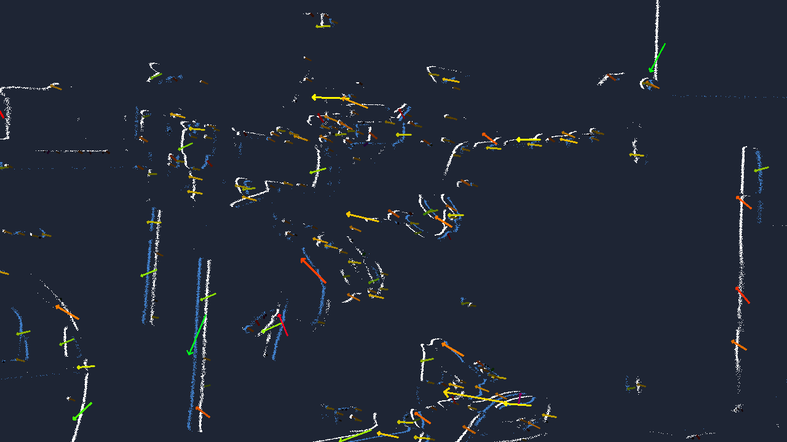

# Sparse optical flow (`evk4_sdk_advanced`)

The first SDK pipeline: it subscribes to the driver's event stream, runs the
Metavision SDK's `SparseOpticalFlowAlgorithm`, and publishes the result — event
edges with **flow-vector arrows** overlaid — as a normal ROS image you view in
`rqt_image_view`.

> Do [tuning.md](../tuning.md) first if you haven't: your `~/my_params.yaml`
> (ERC cap + biases) governs the camera, and that matters here (see *Behavior*).



*Hand and objects moving near the lens: event edges (white/blue) with flow
arrows showing each tracked feature's direction and speed (color-coded).
Published to `/event_camera/flow_image`, viewed in rqt_image_view.*

## Prerequisites

- The SDK installed ([install.md](install.md)).
- The base repo built and working ([../installation.md](../installation.md)).

## 1. Build the package

`evk4_sdk_advanced` is **optional** — a normal `colcon build` skips it when the
SDK isn't found. To build it, point CMake at the SDK. For the **ARM
source-build**, that's the build tree's generated config dir:

```bash
cd ~/ros2_ws
colcon build --packages-select evk4_sdk_advanced --cmake-args \
  -DMetavisionSDK_DIR=$HOME/metavision_src/openeb-5.3.1/build/generated/share/cmake/MetavisionSDKCMakePackagesFilesDir
source install/setup.bash
```

(With an **apt** SDK on x86, omit `-DMetavisionSDK_DIR` — CMake finds it
system-wide. The hazard to avoid is letting a sourced workspace's
`openeb_vendor` satisfy `find_package` first; the explicit `-DMetavisionSDK_DIR`
prevents that.)

The build captures the SDK's library path so the launch can set it
automatically — **you do not need to `source setup_env.sh`.**

## 2. Run

One command brings up the camera (with your params) and the flow node:

```bash
ros2 launch evk4_sdk_advanced optical_flow.launch.py params_file:=$HOME/my_params.yaml
```

In a second terminal, view it:

```bash
ros2 run rqt_image_view rqt_image_view /event_camera/flow_image
```

Move something **close to the lens** — you'll see event edges with colored flow
arrows (the color encodes direction and speed).

| Launch argument | Default | Description |
|---|---|---|
| `params_file` | `''` (stock) | Driver params YAML — use your `~/my_params.yaml` |
| `fps` | `30.0` | Flow image frame rate (Hz) |
| `camera_name` | `event_camera` | Node name / topic namespace |
| `serial` | `''` | Select a camera by serial |
| `frame_id` | `event_camera_optical_frame` | TF frame stamped on the image |
| `debug_timing` | `false` | Log per-stage processing times (profiling) |

| Topic | Type | |
|---|---|---|
| `/event_camera/flow_image` | `sensor_msgs/Image` (bgr8) | published |
| `/event_camera/events` | `event_camera_msgs/EventPacket` | consumed (from the driver) |

The flow node also has an `accumulation_time_us` parameter (default `10000` =
10 ms) — the time window of events drawn per frame.

## Behavior (read this — it's not what you'd guess)

- **Needs close, definite motion.** The tuned config (STC trail filter) keeps
  the event stream clean and *sparse*, so distant hand-waving barely registers.
  Move objects close to the lens to see strong flow.
- **Too much motion makes vectors *disappear* — this is intended.** Sparse
  optical flow tracks *distinct features* and only emits a vector where it can
  confidently match one between moments. Overwhelm the scene (too fast, too
  dense) and there are no separable features to track, so it goes quiet rather
  than guess. The sweet spot is moderate, structured motion.
- **A quiet scene holds the last frame.** No events means no update — correct
  event-camera behavior, not a freeze.

## Validated results (Raspberry Pi 5, 2026-06-16)

- **Latency** (camera → flow image): ~21 ms median, 50 ms p99 — measured with
  `now − header.stamp` at a subscriber.
- **Frame rate**: 30 fps on moderate scenes.
- **Dense scenes are flow-bound on the Pi.** The flow algorithm's cost scales
  with *feature count*: a gentle scene runs ~6.7 Mev/s, a dense/close one
  ~0.5 Mev/s. When a scene exceeds what the Pi can flow in real time, the node
  processes the trackable features and drops the surplus events to stay live —
  which does **not** degrade the vectors (sparse flow samples features). On
  x86/Jetson the full rate is processed. This is the Pi's compute floor, not a
  bug.

## How it works (one paragraph)

The node decodes `EventPacket` to `vector<Metavision::EventCD>` and feeds the
SDK over its camera-independent `process_events` API — so the SDK is consumed,
never modified. Internally it uses **two threads**: the subscription thread
decodes and runs flow *incrementally* per packet (the algorithm is streaming and
goes super-linear on large batches); a frame thread, paced to wall-clock `fps`,
renders one newest frame on demand (`OnDemandFrameGenerationAlgorithm`) and
publishes it. A mutex guards only a cheap buffer swap, so rendering never stalls
ingestion. That split is what keeps latency low; an earlier version that let the
SDK schedule frames on event-time produced a catch-up burst and ~0.5 s lag.

## Reproducible testing with a bag

Live motion is an inconsistent stimulus. For repeatable tuning/regression,
record the event stream once and replay it (deterministic events every run):

```bash
# record (with motion) -- driver only
ros2 launch evk4_bringup evk4.launch.py params_file:=$HOME/my_params.yaml viz:=false &
ros2 bag record -o ~/flow_demo /event_camera/events     # Ctrl+C after ~15 s of motion

# replay through the flow node (no camera needed)
ros2 bag play ~/flow_demo &
ros2 run evk4_sdk_advanced optical_flow --ros-args \
  -r events:=/event_camera/events -r flow_image:=/event_camera/flow_image
```

(Latency must be checked live — a bag carries the original timestamps. The bag
is for throughput, frame rate, and visual quality.)
