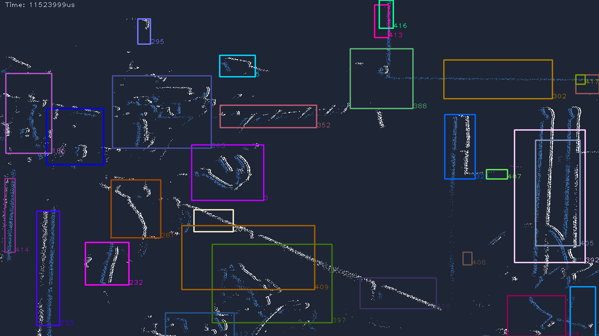

# Object tracking (`evk4_sdk_advanced`)

Tracks moving objects in the event stream and overlays a labeled **bounding
box** on each, published as a ROS image. Like the optical-flow pipeline, it
subscribes to the driver's events and feeds them to a Metavision SDK algorithm
(`TrackingAlgorithm`) via `process_events` — the SDK is consumed, never edited.

Both pipelines share one real-time harness (`event_vision_node.hpp`), so the
build, launch shape, and threading are the same — read
[optical_flow.md](optical_flow.md) for those details; this page only covers
what's different.



*Replay of the test bag: each tracked object gets a colored, ID-labeled box
over the event edges. Published to `/event_camera/tracking_image`.*

## Build and run

`evk4_sdk_advanced` builds both pipelines together — if you've built it for
optical flow ([optical_flow.md](optical_flow.md#1-build-the-package)), tracking
is already built. Then:

All seven pipelines share one launch, selected with `pipeline:=`:

```bash
ros2 launch evk4_sdk_advanced pipeline.launch.py pipeline:=tracking params_file:=$HOME/my_params.yaml
# second terminal:
ros2 run rqt_image_view rqt_image_view /event_camera/tracking_image
```

| Launch argument | Default | Description |
|---|---|---|
| `pipeline` | (required) | Which pipeline to run — `tracking` here |
| `params_file` | `''` | Driver params YAML — use your `~/my_params.yaml` |
| `fps` | `30.0` | Image frame rate (Hz) |
| `debug_timing` | `false` | Log per-stage timing |

Publishes `/event_camera/tracking_image` (`sensor_msgs/Image`).

**Tracker-specific params** (`min_size` / `max_size`, the min/max tracked-object
size in px; defaults 10 / 300) keep their node defaults from this launch —
override them with `--ros-args`, e.g. to widen the size range:

```bash
ros2 launch evk4_sdk_advanced pipeline.launch.py pipeline:=tracking \
    params_file:=$HOME/my_params.yaml
# or run the node directly with overrides:
ros2 run evk4_sdk_advanced tracking --ros-args -p min_size:=5 -p max_size:=500 \
    -r events:=/event_camera/events
```

## Behavior

- **`min_size` / `max_size` set what counts as an object** (in pixels). The
  defaults (10–300) suit hand-sized objects close to the lens; widen the range
  for a scene with very small or large movers.
- **On very dense scenes the tracker spawns many short-lived boxes.** As with
  flow, the tuned (ERC-capped, STC) stream keeps this manageable; an uncapped
  flood produces a lot of spurious tracks.
- A quiet scene holds the last frame (no events → no update), which is correct.

## How it differs from flow (one paragraph)

The harness calls the subclass's `processEvents` (run the tracker per packet),
`stageResults` (merge the latest box per object id — the tracker emits many
updates per object, so we keep one and drop ones unseen for 100 ms), and
`renderFrame` (draw the event image, then `draw_tracking_results` over it). The
real-time threading, decode, and the SDK-lib-path handling are all inherited —
adding a new model-free pipeline is just these three small hooks plus a launch.
