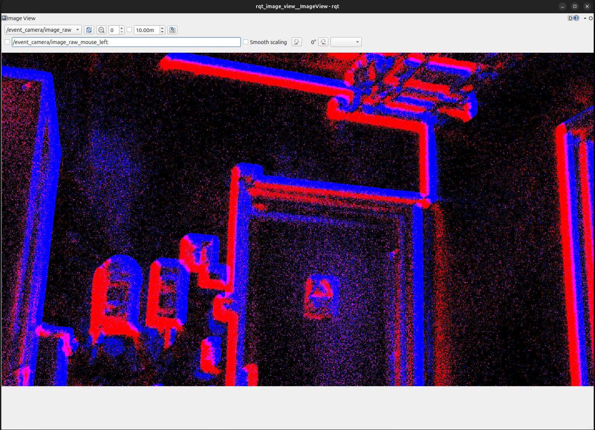

# Usage

## One terminal per running node

A ROS 2 session is several programs running at once, each holding its own
terminal:

- `ros2 launch ...` and `ros2 run ...` start a node and keep running until
  you press **Ctrl+C** — give each its own terminal. A terminal that shows
  nothing after such a command is usually a node working quietly, not a hang.
- One-shot commands (`ros2 param set`, `ros2 service call`, `ros2 topic
  list`, ...) finish on their own and can be typed into any spare terminal.
- A new terminal must have the workspaces sourced before `ros2` sees the
  `evk4_*` packages. The setup script adds this to `~/.bashrc`, so a fresh terminal
  is ready automatically — but only **after you have built the overlay
  once** (installation step 4). If a command like `ros2 launch evk4_bringup
  ...` ever reports "package not found", that terminal isn't sourced: run
  `source ~/ros2_ws/install/setup.bash` (or just open a new terminal).

When docs below show multiple `launch`/`run` commands together, each one
goes in its own terminal.

## Launching the camera

```bash
ros2 launch evk4_bringup evk4.launch.py
```

| Argument | Default | Description |
|---|---|---|
| `camera_name` | `event_camera` | Node name and topic namespace |
| `serial` | `''` (first camera) | Select a camera by serial number |
| `viz` | `true` | Also run the renderer (image topic) |
| `fps` | `25.0` | Renderer frame rate, Hz (with `viz:=true`) |
| `display_type` | `time_slice` | Renderer mode; `sharp` is for busy scenes only ([tuning.md](tuning.md)) |
| `frame_id` | `event_camera_optical_frame` | TF frame stamped on all messages |
| `sync_mode` | `standalone` | Hardware sync role: `standalone`/`primary`/`secondary` ([multi_camera.md](multi_camera.md)) |
| `trigger_in_mode` | `disabled` | External trigger input: `disabled`/`external`/`loopback` (sync with other sensors) |
| `settings` | `''` | Camera settings JSON (pixel masks); also the `save_settings` target |
| `calibration_url` | `''` | Path to a camera_info YAML → publish `camera_info` |
| `rectify` | `false` | Also publish undistorted `image_rect` (needs `calibration_url`) |
| `params_file` | `''` | Swap the params YAML — driver and renderer knobs in one file ([tuning.md](tuning.md)) |

Examples:

```bash
ros2 launch evk4_bringup evk4.launch.py viz:=false           # raw events only
ros2 launch evk4_bringup evk4.launch.py serial:=00050591     # pick a camera
ros2 launch evk4_bringup evk4.launch.py fps:=60.0            # one-off display override
```

Tuning the camera (thresholds, timing, fps, biases) is covered in
[tuning.md](tuning.md) — including the recommended setup and your own
`~/my_params.yaml`; calibration and undistortion in
[calibration.md](calibration.md).

**Architecture note:** the launch composes driver and renderer into a single
container process with intra-process communication, so the high-rate event
stream is passed by pointer between them — never serialized or copied.
Subscribers in *other* processes (your nodes, rosbag2, rqt) receive normal
DDS copies; if you write a high-throughput C++ consumer, implement it as a
composable component and load it into the same container to get the same
zero-copy path.

## Topics

| Topic | Type | When |
|---|---|---|
| `/event_camera/events` | `event_camera_msgs/msg/EventPacket` (EVT3) | always |
| `/event_camera/image_raw` | `sensor_msgs/msg/Image` (default 25 fps) | `viz:=true` |
| `/event_camera/camera_info` | `sensor_msgs/msg/CameraInfo` | `calibration_url` set |
| `/event_camera/image_rect` | `sensor_msgs/msg/Image` (undistorted) | `rectify:=true` ([calibration.md](calibration.md)) |

Message headers carry the `frame_id` launch argument (default
`event_camera_optical_frame`) — set it to match your robot's TF tree
(see [calibration.md](calibration.md)).

## Services (provided by the driver)

| Service | Type | Effect |
|---|---|---|
| `/event_camera/save_settings` | `std_srvs/srv/Trigger` | Write current camera settings to the `settings` file path |

```bash
ros2 service call /event_camera/save_settings std_srvs/srv/Trigger
```

The service only exists while the camera launch is running, and **fails
unless the `settings` launch argument was set at startup**. For bandwidth and
rate statistics no service is needed: the driver prints them to the launch
terminal every second (`statistics_print_interval` parameter, 0 disables):

```
[event_camera]: 254 msgs/s, 7.81 MB/s (queue 0)
```

That counts *published* event packets — the driver publishes lazily, so
`0 msgs/s` just means nothing is currently subscribed to `events`. Note the
renderer itself subscribes lazily too (it logs `subscribing to events!` /
`unsubscribing from events!` as image viewers come and go), so with
`viz:=true` but no open image viewer, `0 msgs/s` is normal. `queue` is the
capture worker's backlog; 0 means it is keeping up.

## Consuming events

> **QoS:** the driver publishes **best-effort**. A subscriber with default
> (reliable) QoS will match nothing and receive nothing. In Python use
> `rclpy.qos.qos_profile_sensor_data`; in C++ use
> `rclcpp::SensorDataQoS()`.

### Python (recommended starting point)

Run the included example, which decodes packets with
[event_camera_py](https://github.com/ros-event-camera/event_camera_py) and
logs event rates:

```bash
ros2 run evk4_examples event_rate
# non-default camera name:
ros2 run evk4_examples event_rate --ros-args -r event_camera/events:=/my_camera/events
```

The decoding core, for your own nodes
(see [`event_rate_node.py`](../evk4_examples/evk4_examples/event_rate_node.py)):

```python
from event_camera_py import Decoder

decoder = Decoder()
decoder.decode(msg)                    # msg: event_camera_msgs/EventPacket
cd_events = decoder.get_cd_events()    # numpy array, fields: x, y, p, t [us]
```

### C++

`evk4_examples_cpp` contains the same example in C++
([`src/event_rate.cpp`](../evk4_examples_cpp/src/event_rate.cpp)), decoding
with [event_camera_codecs](https://github.com/ros-event-camera/event_camera_codecs):

```bash
ros2 run evk4_examples_cpp event_rate
```

It is built as a **composable component**, so for the zero-copy
intra-process path you can run camera + example composed in one container
with a single command:

```bash
ros2 launch evk4_examples_cpp event_rate_composed.launch.py
```

or load it into an already-running camera container by hand:

```bash
ros2 component load /event_camera_container evk4_examples_cpp \
    evk4_examples_cpp::EventRate -e use_intra_process_comms:=true
```

(Inside the container, events reach the component as C++ pointers — no
serialization. The driver's per-second statistics line looks the same
either way — it counts publish calls regardless of transport. Use this
pattern for your own high-rate consumers.)

## Visualization

With `viz:=true` (default):

```bash
ros2 run rqt_image_view rqt_image_view /event_camera/image_raw
```



Blue pixels are ON events (brightness increased), red are OFF events
(brightness decreased) — verified in the renderer source (`bgr8`, ON →
channel 0). A static scene renders black; only change is visible. The
frame rate follows scene activity: a quiet scene updates rarely (correct,
not frozen — see [tuning.md](tuning.md)), a busy one at the full `fps`.

Adjust the frame rate and mode with `fps` / `display_type` — set in your
params YAML alongside everything else, or passed as launch arguments for a
one-off override (they affect only the image, not the raw event stream;
`sharp` is for busy scenes only — see [tuning.md](tuning.md)).

For an undistorted image, calibrate and rectify — see
[calibration.md](calibration.md).

## Bias tuning

Biases are the sensor's analog settings (contrast thresholds, bandwidth,
…). Set them in your params YAML for startup and adjust live with
`ros2 param set` — the workflow, the per-bias effects, and the
noise-reduction ladder are in [tuning.md](tuning.md).

## Recording and playback

Record raw event packets (compact — this is the EVT3 stream, not images):

```bash
ros2 bag record --topics /event_camera/events
```

Play back and analyze offline:

```bash
ros2 bag play <bag>                    # republished on /event_camera/events
ros2 run evk4_examples event_rate      # or your own subscriber
```

`event_camera_py` can also read bags directly in a script (no ROS graph
needed) — see its README. For conversion to/from Prophesee `.raw` files and
other utilities, see
[event_camera_tools](https://github.com/ros-event-camera/event_camera_tools).
